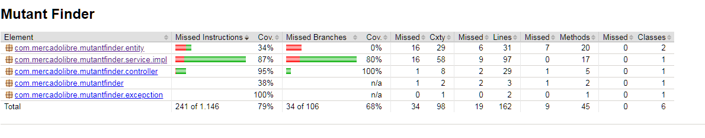
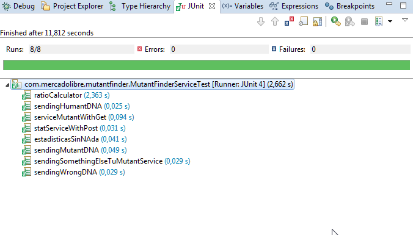

# MUTANTFINDER 
By Javier Martin Gonzalez
Encargado por Mercado Libre

De acuerdo a lo solicitado por parte de la empresa Mercado Libre me propuse aprender cuanta tecnologia estuviera a mano, 
tratando siempre de usar cosas modernas y rapidas, consulte mucho internet y gente conocida para saber cual era lo mejor
de lo que estaba dando vueltas, el resultado a continuacion.

# Tecnologias Utilizadas:

- Java8: El core de la app
- SpringBoot: Api para dar manejo de aplicacion Rest, sencilla, rapida, ideal para el ejercicio en cuestion
- MongoDB: BD No relacional, embebida para este caso, queria darle una vuelta a las BD no relaciones y no defraudo
- Log4j: Logueo
- jUnit: Testing
- Lombok: Ahorro de lineas de configuracion con un par de anotations
- Jacoco: Tests de Cobertura, excelente
- Jmeter: Para hacer testing de trafico
- Maven: Librerias

# La app se hoestea en [Heroku](https://www.heroku.com/)

Intente hostearlo en AWS y Google App Engine, pero me parecio complejo en exceso para el tipo de producto que estaba
tratando de subir, este hosting es rapido y sin vueltas y sin exigencias de tecnologias o librerias como si tenia google
y AWS.

# Los Servicios estan accesibles en la nube(*):

- [mutant](https://whispering-inlet-80058.herokuapp.com/mutant)
- [stats](https://whispering-inlet-80058.herokuapp.com/stats)

(*) Por funcionamiento propio de Heroku quizas la app este dormida, basta con acceder a la API y esperar unos segundos hasta 
que despierte.

# Instrucciones para lanzar la aplicacion en localhost

1) Clonar el proyecto de github (https://github.com/xaavito/mutantfinder)

2) Una vez clonado en un repo propio basta con ir a la carpeta mutantfinder y desde la consola

					java -jar target/mutantfinder-0.0.1-SNAPSHOT.jar

3) Acceder via explorador a:

							localhost:8080/stats

							localhost:8080/mutant

# Cobertura

El test de cobertura de Jacoco da 79%, mas que nada debido a una clase entity que no se accede al equals o ciertos
metodos que no utilize, la funcionalidad del sistema se cubre por encima del 80% perfectamente.
Se adjuntan los reportes de Jacoco en la carpeta coverage.

# Tests

Intente darle al Travis pero me costo, asi hice los tests que estan el codigo fuente y probe lo escencial.

